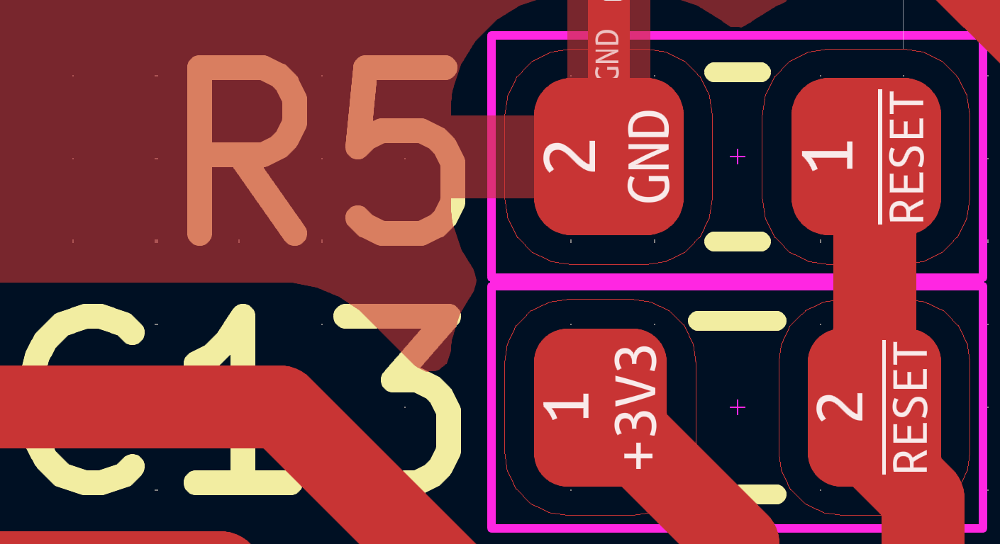
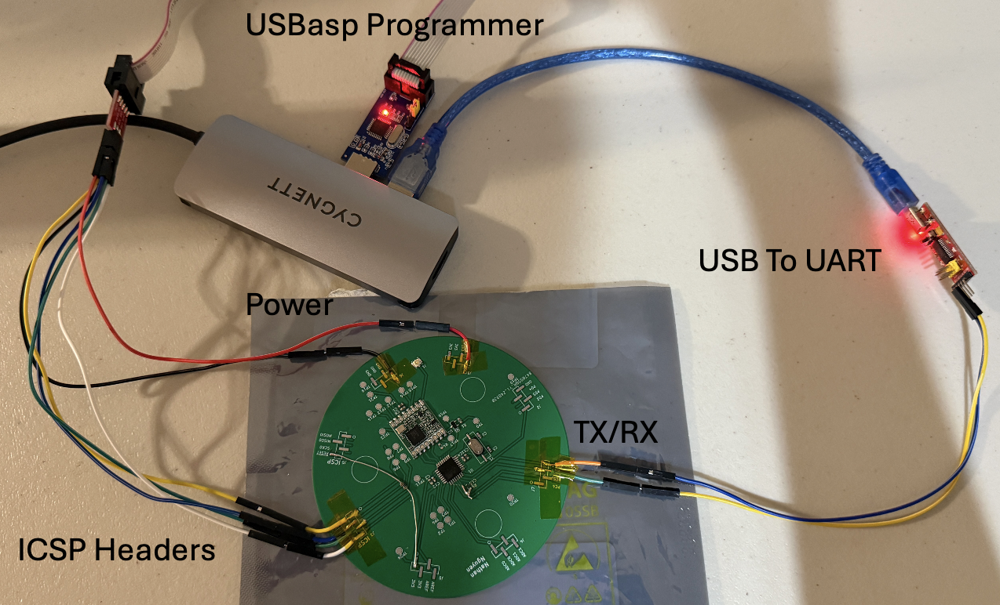

# Issues and Solutions

## Issue 1: Incorrect Silkscreen Component Label C13 And R5

**Description**:  
The label for components C13 and R5 on the silkscreen are in the incorrect places. 

**Solution**:  
1. The resistor should be placed between the 3.3 V and reset line as it is a pull up resistor. 
2. Keep the path between Gnd and reset left open. Use a piece of wire or button to force a reset if needed.

---

## Issue 2: Serial Not Responding

**Description**:  
The basic setup requires a USBasp programmer for flashing new program onto the ATmega328pb and a Usb to uart device for access to the serial. In software, select a baud rate 
to interface with the serial monitor.

**Solution**:
1. Check if the baud rate is matches the one that was set.
2. Switch the tx and rx cable around.
3. Hard reset the system by connecting the reset pin on the ATmega328pb to ground.

---